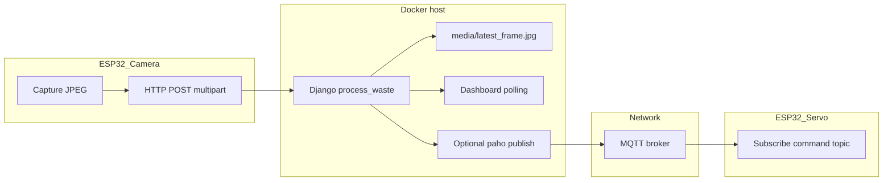

# Django server, ESP32 ingest, Docker, and live dashboard

## Current baseline (what you already have)

- **Ingest API**: `[MCU_Server/detection/views.py](D:/TAIST-Tokyo/Module%202/ICT720%20Drone%20and%20FullstackAIoT/Waste-Management-System/MCU_Server/detection/views.py)` — `POST /api/waste/` with multipart field `**image` (matches `[MCU_Server/simulate_camera.py](D:/TAIST-Tokyo/Module%202/ICT720%20Drone%20and%20FullstackAIoT/Waste-Management-System/MCU_Server/simulate_camera.py)`).
- **Dashboard**: `[MCU_Server/detection/templates/dashboard.html](D:/TAIST-Tokyo/Module%202/ICT720%20Drone%20and%20FullstackAIoT/Waste-Management-System/MCU_Server/detection/templates/dashboard.html)` — polls `/media/latest_frame.jpg` and `/api/status/` every 500 ms (good enough for “real-time” from an ESP32).
- **Docker**: `[MCU_Server/Dockerfile](D:/TAIST-Tokyo/Module%202/ICT720%20Drone%20and%20FullstackAIoT/Waste-Management-System/MCU_Server/Dockerfile)` + `[MCU_Server/docker-compose.yml](D:/TAIST-Tokyo/Module%202/ICT720%20Drone%20and%20FullstackAIoT/Waste-Management-System/MCU_Server/docker-compose.yml)` — `runserver 0.0.0.0:8000`, port `8000:8000`.
- **Firmware gap**: `[MCU_Camera/src/main.cpp](D:/TAIST-Tokyo/Module%202/ICT720%20Drone%20and%20FullstackAIoT/Waste-Management-System/MCU_Camera/src/main.cpp)` currently classifies on-device (Edge Impulse) and sends **MQTT** only; it does not POST images to Django yet.
- **Servo contract**: Payloads must match `[shared_lib/wifi_op/mqtt_cmd.h](D:/TAIST-Tokyo/Module%202/ICT720%20Drone%20and%20FullstackAIoT/Waste-Management-System/shared_lib/wifi_op/mqtt_cmd.h)` — `**BIO`** and `**N-BIO\*\`(not`NON-BIO`) on topic from `[platformio.ini](D:/TAIST-Tokyo/Module%202/ICT720%20Drone%20and%20FullstackAIoT/Waste-Management-System/platformio.ini)`: `waste-management-system/command`.

---

## Step 1 — Run Django in Docker reliably

1. From `**MCU_Server**`, build and run: `docker compose build` then `docker compose up` (or equivalent). Confirm `http://localhost:8000/` shows the dashboard and `simulate_camera.py` (run on the host) can still hit `http://127.0.0.1:8000/api/waste/` if you test without the ESP32.
2. **ESP32 to container networking**: The ESP32 must POST to the **host’s LAN IP** (e.g. `http://192.168.x.x:8000/api/waste/`), not `localhost` (that would mean the ESP32 itself). Ensure the PC firewall allows inbound TCP 8000 if needed.
3. **Django `ALLOWED_HOSTS`**: Today it is empty in `[MCU_Server/config/settings.py](D:/TAIST-Tokyo/Module%202/ICT720%20Drone%20and%20FullstackAIoT/Waste-Management-System/MCU_Server/config/settings.py)`. Set it from an env var (e.g. `ALLOWED_HOSTS=localhost,127.0.0.1,<your-lan-ip>`) so the server accepts requests from the browser and from the ESP32 hostname/IP you use.
4. `**DEBUG**`: `docker-compose.yml` already passes `DEBUG=1`; wire `settings.py` to `os.environ.get("DEBUG", "1") == "1"` if you want the container to respect that flag consistently.

---

## Step 2 — Server-side BIO / NON-BIO decision (replace mock)

`[requirements.txt](D:/TAIST-Tokyo/Module%202/ICT720%20Drone%20and%20FullstackAIoT/Waste-Management-System/MCU_Server/requirements.txt)` already includes `**ultralytics**`. There is **no** `.pt` model in the repo yet, so you will add one.

1. **Obtain a model**: Train or export a YOLOv8 (or compatible) model whose class names you control (e.g. `BIO`, `N-BIO` or names you map in code). Place it under something like `MCU_Server/detection/models/waste.pt` (or `media/` — keep it out of `collectstatic` confusion; a dedicated folder is clearer).
2. **Inference in `process_waste`**: After `cv2.imdecode`, run Ultralytics on the BGR image, take the top detection (or majority vote), map model class names to:

- **Display strings** for the dashboard (`detected_type`, `action_taken`).
- **MQTT payloads** exactly `**BIO`** or `**N-BIO\*\` for the servo.

1. **Performance**: First request may be slow while weights load; optionally **lazy-load** the model once at startup (e.g. module-level or `AppConfig.ready()`) to avoid reloading every POST.
2. **Fallback**: If no detection or low confidence, return a clear JSON error or a default “unknown” path and avoid publishing a servo command.

---

## Step 3 — Optional but recommended: Django publishes MQTT after classification

`paho-mqtt` is in requirements and imported in `views.py` but not used for publishing yet.

1. Add settings (env-driven): `MQTT_BROKER_HOST`, `MQTT_BROKER_PORT`, optional user/password, and topic `**waste-management-system/command` (same as firmware).
2. After a successful classification, **publish** the same string the camera used: `BIO` or `N-BIO`.
3. **Broker in Docker (local dev)**: Add an `**eclipse-mosquitto`** (or similar) service to `[MCU_Server/docker-compose.yml](D:/TAIST-Tokyo/Module%202/ICT720%20Drone%20and%20FullstackAIoT/Waste-Management-System/MCU_Server/docker-compose.yml)`, expose `1883`, and point Django’s `MQTT_BROKER_HOST` to that service name. ESP32 WiFi must use the **host IP as broker (or a cloud broker you already use).
4. **Avoid double commands**: If the server publishes sorting commands, disable or gate the MQTT sends in `[MCU_Camera/src/main.cpp](D:/TAIST-Tokyo/Module%202/ICT720%20Drone%20and%20FullstackAIoT/Waste-Management-System/MCU_Camera/src/main.cpp)` so only one authority drives the servo.

---

## Step 4 — ESP32: send the camera image to Django

1. **Initialize WiFi** (you already have `[shared_lib/wifi_op](D:/TAIST-Tokyo/Module%202/ICT720%20Drone%20and%20FullstackAIoT/Waste-Management-System/shared_lib/wifi_op)`).
2. **Capture a JPEG**: Use your camera stack’s JPEG encoder (or capture RGB and encode) so the body is valid JPEG bytes.
3. **HTTP POST** with Arduino `**HTTPClient`**: `POST` to `http://<PC_LAN_IP>:8000/api/waste/` with `multipart/form-data` and part name `**image\*\`(must match Django’s`request.FILES.get('image')`).
4. **Rate limiting**: Post on a timer (e.g. 1–2 FPS for preview) or only when you want a classification, to avoid WiFi saturation and Django load.

---

## Step 5 — Real-time display (minimal change)

No change is strictly required: the dashboard already cache-busts `latest_frame.jpg` and polls status. Optional improvements later:

- Tune interval (500 ms vs 1000 ms) vs ESP32 upload rate.
- Add a visible “last updated” timestamp from `latest_data` if you extend the JSON API.

---

## Step 6 — Verification checklist

| Check          | How                                                                             |
| -------------- | ------------------------------------------------------------------------------- |
| Docker         | Dashboard at `http://localhost:8000/`, admin/static/media OK                    |
| API            | `simulate_camera.py` or `curl` multipart POST returns success                   |
| Classification | Wrong vs right test images change `detected_type` and annotated saved frame     |
| ESP32          | Serial logs show HTTP 200; dashboard image updates                              |
| Servo          | MQTT message `BIO` / `N-BIO` received on subscribed topic after server decision |

---

## Risk notes (short)

- `**runserver` in Docker** is fine for coursework/demo; production would use **gunicorn/uvicorn** + reverse proxy. Multi-worker processes would break the current **in-memory `latest_data` unless you move state to Redis or the database.
- **Large Ultralytics images** increase image size and RAM; the slim Python base + existing OpenCV apt deps are a reasonable start; monitor container memory.
