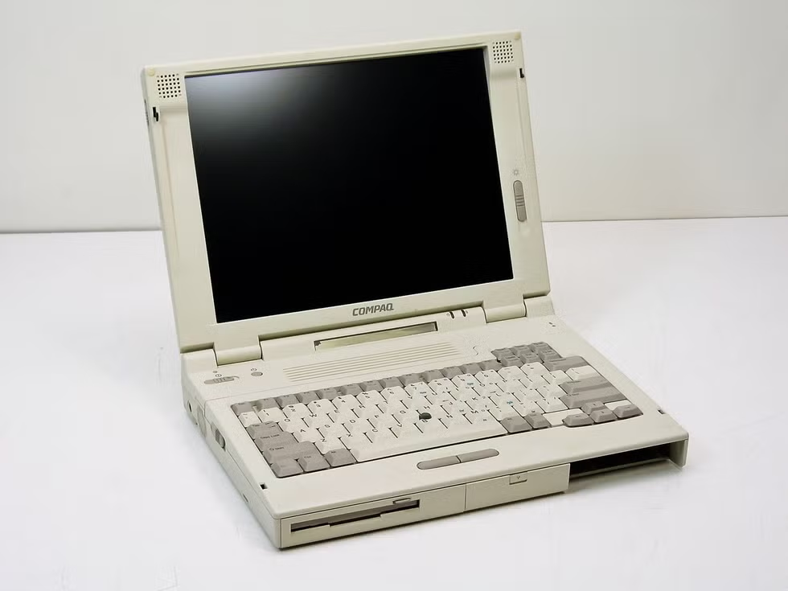

# Waste-Management-System

## Table of Contents

<details>
<summary>Table of Contents</summary>

1. [Project Overview](#project-overview)
2. [Objectives](#objectives)
3. [Team Members](#team-members)
4. [Stakeholders](#stakeholders)
5. [User Stories](#user-stories)
6. [Hardware Components](#hardware-components)
7. [Software Components](#software-components)
8. [Project Structure](#project-structure)
9. [Image detection and classification](#image-detection-and-classification)
10. [How it Works](#how-it-works)
11. [Dashboard and Monitoring](#dashboard-and-monitoring)
12. [For Future Work](#for-future-work)
13. [Conclusion](#conclusion)

</details>

## Project Overview

The Waste Management System is an AIoT-based solution designed to optimize waste segregation and management. The system utilizes a combination of hardware components, including microcontrollers and actuators, to automate the process of sorting biodegradable and non-biodegradable waste. The project aims to enhance efficiency in waste management while promoting environmental sustainability.

## Objectives

1. Build an AIoT waste classification system that can detect waste type in real time using a camera-based ML model.

2. Separate waste automatically into Biodegradable and Non-Biodegradable bins using servo actuators.

3. Enable communication between two microcontrollers through Wi-Fi and MQTT for reliable command delivery.

4. Design the system with clear state-based control so each subsystem can be monitored and extended.

5. Provide a base architecture that can be expanded for more classes, more sensors, and data logging in future iterations.

## Team Members

| Name                 | ID         | University Host      |
| -------------------- | ---------- | -------------------- |
| Worapob Wannatang    | 6814552841 | Kasetsart University |
| Purin Chirapornchai  | 6814552809 | Kasetsart University |
| Jakapat Dungdee      | 6814552825 | Kasetsart University |
| Kritsana Netpugdee   | 6814552795 | Kasetsart University |
| Kaung Pyae Min Thein | 6822040256 | SIIT                 |

## Stakeholders

| #   | Stakeholder                     | Need                                                                                    |
| --- | ------------------------------- | --------------------------------------------------------------------------------------- |
| 1   | **Residents (End Users)**       | Quick and accurate waste disposal with minimal manual effort.                           |
| 2   | **Municipality Operators**      | Consistent sorting quality to reduce re-sorting work and improve collection efficiency. |
| 3   | **Environmental Organizations** | Reliable waste-separation data to support campaigns and policy recommendations.         |

## User Stories

| #   | As a ...              | I want ...                                  | So that ...                                              |
| --- | --------------------- | ------------------------------------------- | -------------------------------------------------------- |
| 1   | Resident              | The system to sort waste automatically      | Disposal is easy and correct.                            |
| 2   | Municipality Operator | Reliable BIO/N-BIO sorting                  | Manual correction effort and operating cost are reduced. |
| 3   | Environmental Analyst | To monitor classification trends            | I can support waste management decisions with data.      |
| 4   | Environmental Analyst | A dashboard view of classification activity | I can monitor waste-sorting trends over time.            |

## Hardware Components

### Core Components

| Component                         | Quantity | Purpose                                                                                                |
| --------------------------------- | -------- | ------------------------------------------------------------------------------------------------------ |
| LilyGo T-SIMCAM ESP32-S3          | 1        | Microcontroller with camera module for inferencing and sending data to Cucumber RS                     |
| Cucumber RS                       | 1        | Microcontroller for receiving data from LilyGo T-SIMCAM ESP32-S3 and controlling actuators             |
| Personal Computer (for Dashboard) | 1        | For monitoring and visualizing classification data and system status through a dashboard interface     |
| Servo Motors                      | 1        | Actuator for controlling the separation of type of waste for Biodegradable and Non-Biodegradable waste |

---

### Microcontroller

#### _LilyGo T-SIMCAM ESP32-S3_


- **Role**: Inferencing and sending data to Cucumber RS (via MQTT publish to broker)
- **Communication**: Wi-Fi + MQTT publish to command topic + HTTP image upload to server
- **MQTT Broker**: broker.emqx.io:1883
- **MQTT Client ID**: esp32s3box_camera
- **Topic**: waste-management-system/command

#### _Cucumber RS_


- **Role**: Controlling actuators based on received commands from LilyGo T-SIMCAM ESP32-S3 (MQTT subscribe to command topic and execute servo movement)
- **Communication**: Wi-Fi + MQTT subscribe to command topic and execute servo movement
- **MQTT Client ID**: esp32s2_servo
- **Topic**: waste-management-system/command

### Personal Computer (for Dashboard)



- **Role**: For monitoring and visualizing classification data and system status through a dashboard interface
- **Communication**: Wi-Fi + MQTT (real-time command stream) + HTTP (dashboard page/config and image metadata)

### Servo Motor


- **Role**: Actuator for controlling the separation of type of waste for Biodegradable and Non-Biodegradable waste

---

### Additional Requirements

- **Power supply:**
  - USB power for both microcontrollers
  - Servo motors using 5V from the Cucumber RS pin headers.
- **Wires and Connectors:**
  - Jumper wires for GPIO control, common ground between MCU and servos.
- **Waste bins:**
  - Two physical bins or channels for Biodegradable and Non-Biodegradable outputs.

## Software Components

- **Edge Impulse Inferencing Module**:
  - Captures camera frames and runs Edge Impulse inference to detect waste, then maps model output labels to BIO and N-BIO commands. ([ESP32-Cam-Edge-Impulse](https://github.com/luisomoreau/ESP32-Cam-Edge-Impulse))

- **Wi-Fi + MQTT + HTTP Communication Layer**:
  - Uses Wi-Fi and PubSubClient MQTT to publish commands from the camera MCU and subscribe/receive commands on the servo MCU, while using HTTP to upload captured images/metadata to the server.
- **FreeRTOS Task Scheduler**:
  - The servo MCU runs three concurrent RTOS tasks — `mqttTask` (MQTT keep-alive), `servoTask` (command execution and servo movement), and `guardTask` (fast state guard that drops buffered commands when the servo is not READY) — to safely handle concurrent message reception and physical actuation.
- **Servo Control Logic**:
  - Implements a state machine (READY / BUSY) to control servo movements based on received commands, ensuring safe operation and preventing command conflicts.
- **Django Backend Server**:
  - A Python Django web server that exposes an HTTP `/upload` endpoint to receive images and metadata from the camera MCU, stores records in a SQLite database, and serves the dashboard page.
- **Dashboard Interface**:
  - A web-based dashboard to visualize incoming classification commands and system status in near real time for monitoring and demonstration purposes.

## Project Structure

The project is split into three independent modules and one shared library:

**`MCU_Camera`** — ESP32-S3 camera inference module

```
MCU_Camera/
├── src/
│   ├── main.cpp          # Entry point: AI inference loop, MQTT publish, HTTP image upload
│   ├── ai_handler.cpp    # Edge Impulse inference and result parsing
│   └── hw_camera.cpp     # Camera hardware initialization and frame capture
├── include/
│   ├── ai_handler.h
│   └── hw_camera.h
└── lib/
    └── Waste_Management_Project_inferencing/  # Compiled Edge Impulse model library
```

**`MCU_Servo`** — ESP32-S2 servo control module

```
MCU_Servo/
├── src/
│   └── main.cpp          # Entry point: MQTT receive and servo movement (RTOS tasks)
└── lib/
    └── servo_motor/
        ├── servo_motor.cpp   # Servo motor control logic
        └── servo_motor.h
```

**`shared_lib`** — Shared firmware library (used by both MCUs)

```
shared_lib/
├── wifi_op/
│   ├── wifi_op.cpp / .h   # Wi-Fi and MQTT connection management
│   └── mqtt_cmd.h         # MQTT command string definitions
└── system_state/
    └── system_state.cpp / .h  # State machine (READY / BUSY) for the servo MCU
```

**`MCU_Server`** — Django web server and dashboard

```
MCU_Server/
├── manage.py
├── requirements.txt
├── config/               # Django project settings and URL routing
└── detection/            # Main app: HTTP endpoints, static files, dashboard template
    ├── views.py          # Image upload endpoint and dashboard view
    ├── static/detection/
    │   └── js/
    │       └── dashboard.js        # Real-time dashboard update logic
    └── templates/
        └── dashboard.html          # Dashboard UI
```

---

## Image detection and classification

The camera MCU captures image frames and runs Edge Impulse inference to detect waste type. The model outputs a class label (for example: "B" for biodegradable, "NB" for non-biodegradable) and confidence score. The camera MCU then maps these labels to command messages (BIO or N-BIO) and publishes them over MQTT to the servo MCU for actuation.

Only valid detections with confidence above a certain threshold will trigger command publishing to ensure reliable operation. The camera MCU also uploads captured images and metadata (timestamp, detected class, confidence) to a server via HTTP for dashboard monitoring.

`#define CONFIDENCE_THRESHOLD 0.5`

Specification:

| Item       | Details                                                                                                                 |
| ---------- | ----------------------------------------------------------------------------------------------------------------------- |
| **Input**  | Image frames captured by the camera module (240x240 pixels, RGB format)                                                 |
| **Output** | Detected class label (for example: "B" for biodegradable, "NB" for non-biodegradable) and confidence score (0.0 to 1.0) |

Example output from the camera MCU:

```

Predictions (DSP: 4 ms, Classification: 144 ms, Anomaly: 0 ms):
Detected: B with confidence 0.64
Location: x:24, y:16, w:8, h:8

```

---

## How it Works

### State Diagram


1. **System Startup**
   - The camera MCU initializes Serial, PSRAM, and camera hardware.
   - The servo MCU initializes Serial, servo controller, Wi-Fi, and MQTT client, then enters READY state.

2. **Waste Capture and AI Inference**
   - The camera MCU captures an image frame and runs Edge Impulse inference to detect an object and class label.

3. **Classification Decision**
   - If a valid object is detected, the camera MCU maps model labels to command messages:
     - BIO for biodegradable waste
     - N-BIO for non-biodegradable waste

4. **Command Transmission**
   - The camera MCU publishes the command over MQTT to Topic: waste-management-system/command.

5. **Command Reception and Validation**
   - The servo MCU receives the MQTT payload, checks that the servo state machine is READY, then transitions to command-processing state.

6. **Servo Action**
   - Based on received payload:
     - BIO triggers servo movement to biodegradable position.
     - N-BIO triggers servo movement to non-biodegradable position.

7. **Return to Safe Position**
   - After a short delay for disposal, the servo returns to home position and state returns to READY for the waste separation.

8. **Send data to server for dashboard monitoring**
   - The camera MCU also uploads captured images and metadata (timestamp, detected class, confidence) to a server via HTTP for dashboard monitoring.

## Dashboard and Monitoring


The dashboard provides a lightweight real-time view of system activity for demonstration and validation.
It focuses on operational visibility rather than control logic.

_Summary:_

1. Shows incoming waste classification commands (BIO / N-BIO) from MQTT in near real time.
2. Displays recent activity to help confirm that camera inference and command publishing are working.
3. Helps operators quickly check if the communication pipeline is active during testing.
4. Supports basic monitoring of behavior trends such as repeated class output over short periods.

## How to Run

### Prerequisites

| Tool                                                          | Purpose                                      |
| ------------------------------------------------------------- | -------------------------------------------- |
| [PlatformIO IDE](https://platformio.org/) (VS Code extension) | Build and flash firmware for both MCUs       |
| Python 3.x + pip                                              | Run the Django server                        |
| USB cables                                                    | Connect both ESP32 boards to PC for flashing |

---

### Step 1 — Configure Wi-Fi credentials

Open `shared_lib/wifi_op/wifi_op.cpp` and update the SSID and password to match your local network:

```cpp
#define WIFI_SSID     "YourWiFiSSID"
#define WIFI_PASSWORD "YourWiFiPassword"
```

> Both MCUs share this file, so one change applies to both boards.

---

### Step 2 — Configure the server IP

Open `MCU_Camera/src/main.cpp` and update the server IP to match your PC's address on the local network:

```cpp
// sendImageHTTP() — update the IP to your PC's local address
snprintf(url, sizeof(url), "http://192.168.1.104:8000/upload?...", ...);
```

> Run `ipconfig` (Windows) or `ip a` (Linux/Mac) to find your PC's local IP.

---

### Step 3 — Flash MCU_Camera (LilyGo T-SIMCAM ESP32-S3)

1. Connect the LilyGo T-SIMCAM board via USB.
2. In VS Code, open the PlatformIO sidebar and select the `esp32s3box` environment, **or** run:

```bash
pio run --target upload --environment esp32s3box
```

3. Open the Serial Monitor at **115200 baud** to verify the board connects to Wi-Fi and MQTT.

---

### Step 4 — Flash MCU_Servo (Cucumber RS ESP32-S2)

1. Connect the Cucumber RS board via USB.
2. Select the `esp32-s2-saola-1` environment and upload, **or** run:

```bash
pio run --target upload --environment esp32-s2-saola-1
```

3. Open the Serial Monitor to confirm the servo MCU reaches READY state.

---

### Step 5 — Run the Django Server

```bash
cd MCU_Server
python -m venv .venv

# Windows
.venv\Scripts\activate

# macOS / Linux
source .venv/bin/activate

pip install -r requirements.txt
python manage.py migrate
python manage.py runserver 0.0.0.0:8000
```

The dashboard is available at: **`http://<your-PC-IP>:8000`**

> Use `0.0.0.0:8000` (not `127.0.0.1`) so the camera MCU can reach the server over the local network.

---

### Step 6 — Verify the System

1. Point the camera at a piece of waste.
2. Check the Serial Monitor on the camera MCU — a detection line should appear:
   ```
   Detected: B with confidence 0.64
   ```
3. The servo MCU Serial Monitor should show the received command and servo movement.
4. The dashboard at `http://<your-PC-IP>:8000` should display the latest classification event.

---

### Configuration Reference

All key parameters are defined in `platformio.ini` (firmware) and `MCU_Server/config/settings.py` (server):

| Parameter                   | Location                         | Default                             |
| --------------------------- | -------------------------------- | ----------------------------------- |
| Wi-Fi SSID / Password       | `shared_lib/wifi_op/wifi_op.cpp` | `YourWiFiSSID` / `YourWiFiPassword` |
| Server IP (for HTTP upload) | `MCU_Camera/src/main.cpp`        | `192.168.1.104`                     |
| MQTT Broker                 | `platformio.ini`                 | `broker.emqx.io:1883`               |
| MQTT Command Topic          | `platformio.ini`                 | `waste-management-system/command`   |
| Confidence Threshold        | `MCU_Camera/src/main.cpp`        | `0.5`                               |
| Send Cooldown Interval      | `MCU_Camera/src/main.cpp`        | `5000 ms`                           |

## For Future Work

- Extend the system to sort more waste types (for example: plastic, paper, glass, and metal) to support real-world waste separation better.

- Analyze collected classification data to improve future waste management decisions, such as pickup planning, bin placement, and waste trend monitoring.

## Demonstration Video

A demonstration video of the system in action is available at: [https://www.youtube.com/watch?v=example](https://www.youtube.com/watch?v=example)

## Conclusion

The Waste Management System project demonstrates the integration of AIoT technologies to enhance waste segregation and management. By automating the process, the system aims to improve efficiency, reduce operational costs, and promote environmental sustainability.
