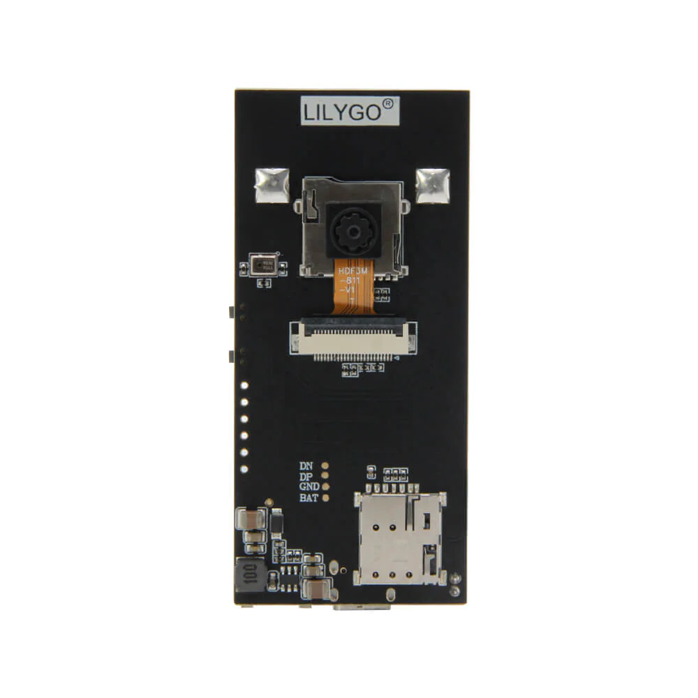
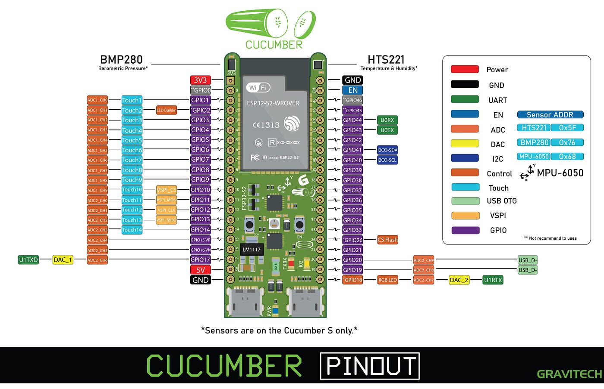

# Waste-Management-System

## Project Overview

The Waste Management System is an AIoT-based solution designed to optimize waste segregation and management. The system utilizes a combination of hardware components, including microcontrollers and actuators, to automate the process of sorting biodegradable and non-biodegradable waste. The project aims to enhance efficiency in waste management while promoting environmental sustainability.

## Objectives

Text here

## Team Members

| Name | ID  | University Host |
| ---- | --- | --------------- |
| A    | 000 | University A    |
| B    | 000 | University B    |
| C    | 000 | University C    |
| Jakapat Dungdee    | 6814552825 | Kasetsart University |
| Kritsana Netpugdee    | 6814552795 | Kasetsart University    |

## Stakeholders

1. Local Municipalities: Interested in implementing efficient waste management systems to improve sanitation and reduce environmental impact.

2. Environmental Organizations: Focused on promoting sustainable waste management practices and reducing pollution.

3. Residents and Businesses: End-users of the waste management system who will benefit from improved waste segregation and disposal.

## User Stories

1. As a resident, I want to easily dispose of my waste in the correct bins so that I can contribute to environmental sustainability.

2. As a local municipality, I want to implement an automated waste management system to improve efficiency and reduce operational costs.

3. As an environmental organization, I want to promote the use of sustainable waste management practices to reduce pollution and protect the environment.

## Hardware Components

### Core Components

| Component                | Quantity | Purpose                                                                                                |
| ------------------------ | -------- | ------------------------------------------------------------------------------------------------------ |
| LilyGo T-SIMCAM ESP32-S3 | 1        | Microcontroller with camera module for inferencing and sending data to Cucumber RS                     |
| Cucumber RS              | 1        | Microcontroller for receiving data from LilyGo T-SIMCAM ESP32-S3 and controlling actuators             |
| Servo Motors             | 2        | Actuator for controlling the separation of type of waste for Biodegradable and Non-Biodegradable waste |

---

### Microcontroller

#### _LilyGo T-SIMCAM ESP32-S3_

- **Role**: Camera inferencing and sending data to MCU_B
- **Communication**: To be determined

#### _Cucumber RS_

- **Role**: Receiving data from MCU_A and controlling actuators
- **Communication**: To be determined

### Additional Requirements

- **Power supply:**
- **Wires and Connectors:**
- **Waste bins:**

## Software Components

- **Camera Inferencing Algorithm**: Developed using machine learning techniques to classify waste into biodegradable and non-biodegradable categories.
- **Communication Protocol**: Implemented to facilitate data exchange between the two microcontrollers (MCU_A and MCU_B).
- **Actuator Control Logic**: Software logic to control the servo motors based on the classification results from the camera inferencing algorithm.
- **User Interface**: Optional interface for monitoring the system status and waste levels in the bins.

## State Diagram

## System Architecture

---

## How it Works

1. The LilyGo T-SIMCAM ESP32-S3 captures images of the waste and processes them using the camera inferencing algorithm to classify the waste type.

2. The classification results are sent to the Cucumber RS microcontroller via the communication protocol.

3. The Cucumber RS receives the data and controls the servo motors to separate the waste into the appropriate bins based on the classification results.

## Conclusion

The Waste Management System project demonstrates the integration of AIoT technologies to enhance waste segregation and management. By automating the process, the system aims to improve efficiency, reduce operational costs, and promote environmental sustainability. Future work may include expanding the system to handle more waste categories and integrating additional sensors for improved accuracy.
