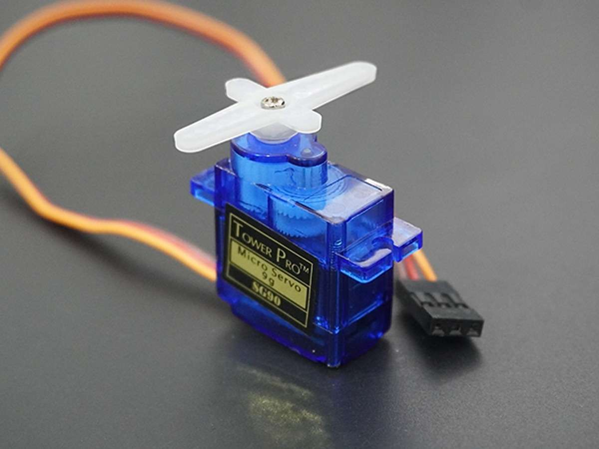
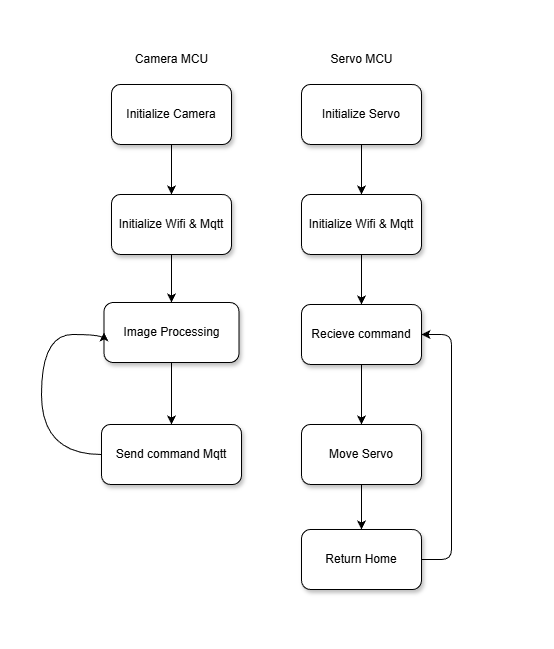
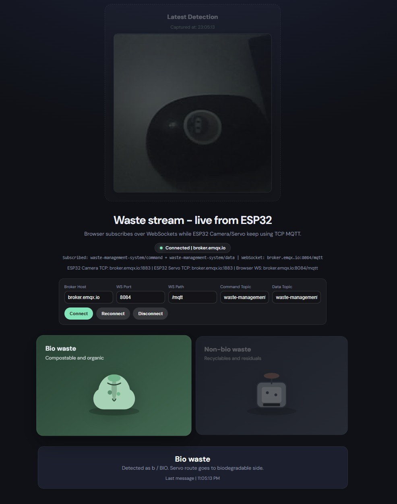

# Waste-Management-System

## Table of Contents

<details>
<summary>Table of Contents</summary>

1. [Project Overview](#project-overview)
2. [Objectives](#objectives)
3. [Team Members](#team-members)
4. [Stakeholders](#stakeholders)
5. [User Stories](#user-stories)
6. [Hardware Components](#hardware-components)
7. [Software Components](#software-components)
8. [Image detection and classification](#image-detection-and-classification)
9. [How it Works](#how-it-works)
10. [Dashboard and Monitoring](#dashboard-and-monitoring)
11. [For Future Work](#for-future-work)
12. [Conclusion](#conclusion)

</details>

## Project Overview

The Waste Management System is an AIoT-based solution designed to optimize waste segregation and management. The system utilizes a combination of hardware components, including microcontrollers and actuators, to automate the process of sorting biodegradable and non-biodegradable waste. The project aims to enhance efficiency in waste management while promoting environmental sustainability.

## Objectives

1. Build an AIoT waste classification system that can detect waste type in real time using a camera-based ML model.

2. Separate waste automatically into Biodegradable and Non-Biodegradable bins using servo actuators.

3. Enable communication between two microcontrollers through Wi-Fi and MQTT for reliable command delivery.

4. Design the system with clear state-based control so each subsystem can be monitored and extended.

5. Provide a base architecture that can be expanded for more classes, more sensors, and data logging in future iterations.

## Team Members

| Name                 | ID         | University Host      |
| -------------------- | ---------- | -------------------- |
| Worapob Wannatang    | 6814552841 | Kasetsart University |
| Purin Chirapornchai  | 6814552809 | Kasetsart University |
| Jakapat Dungdee      | 6814552825 | Kasetsart University |
| Kritsana Netpugdee   | 6814552795 | Kasetsart University |
| Kaung Pyae Min Thein | 6822040256 | SIIT                 |

## Stakeholders

1. **Residents (End Users)**: Need quick and accurate waste disposal with minimal manual effort.

2. **Municipality Operators**: Need consistent sorting quality to reduce re-sorting work and improve collection efficiency.

3. **Environmental Organizations**: Need reliable waste-separation data to support campaigns and policy recommendations.

## User Stories

1. As a resident, I want the system to sort waste automatically, so that disposal is easy and correct.

2. As a municipality operator, I want reliable BIO/N-BIO sorting, so that manual correction effort and operating cost are reduced.

3. As an environmental analyst, I want to monitor classification trends, so that I can support waste management decisions with data.

4. As an environmental analyst, I want a dashboard view of classification activity, so that I can monitor waste-sorting trends over time.

## Hardware Components

### Core Components

| Component                | Quantity | Purpose                                                                                                |
| ------------------------ | -------- | ------------------------------------------------------------------------------------------------------ |
| LilyGo T-SIMCAM ESP32-S3 | 1        | Microcontroller with camera module for inferencing and sending data to Cucumber RS                     |
| Cucumber RS              | 1        | Microcontroller for receiving data from LilyGo T-SIMCAM ESP32-S3 and controlling actuators             |
| Servo Motors             | 1        | Actuator for controlling the separation of type of waste for Biodegradable and Non-Biodegradable waste |

---

### Microcontroller

#### _LilyGo T-SIMCAM ESP32-S3_


- **Role**: Inferencing and sending data to Cucumber RS (via MQTT publish to broker)
- **Communication**: Wi-Fi + MQTT publish to command topic + HTTP image upload to server
- **MQTT Broker**: broker.emqx.io:1883
- **MQTT Client ID**: esp32s3box_camera
- **Topic**: waste-management-system/command

#### _Cucumber RS_


- **Role**: Controlling acutors based on received commands from LilyGo T-SIMCAM ESP32-S3 (MQTT subscribe to command topic and execute servo movement)
- **Communication**: Wi-Fi + MQTT subscribe to command topic and execute servo movement
- **MQTT Client ID**: esp32s2_servo
- **Topic**: waste-management-system/command

#### _Servo Motor_



- **Role**: Actuator for controlling the separation of type of waste for Biodegradable and Non-Biodegradable waste

---

### Additional Requirements

- **Power supply:**
  - USB power for both microcontrollers
  - Servo motors using 5V from the Cucumber RS pin headers.
- **Wires and Connectors:** Jumper wires for GPIO control, common ground between MCU and servos.
- **Waste bins:** Two physical bins or channels for Biodegradable and Non-Biodegradable outputs.

## Software Components

- **Edge Impulse Inferencing Module**: Captures camera frames and runs Edge Impulse inference to detect waste, then maps model output labels to BIO and N-BIO commands.
- **Wi-Fi + MQTT + HTTP Communication Layer**: Uses Wi-Fi and PubSubClient MQTT to publish commands from the camera MCU and subscribe/receive commands on the servo MCU, while using HTTP to upload captured images/metadata to the server.
- **Servo Control Module**: Executes actuator movement for BIO and N-BIO sorting, then returns servos to home position after disposal.
- **State-Based Control**: Uses a servo state machine to ensure commands are processed safely and in order.
- **Monitoring Interface**: A dashboard/UI for monitoring classification history, timestamps, and bin-related status.

## Image detection and classification

The camera MCU captures image frames and runs Edge Impulse inference to detect waste type. The model outputs a class label (for example: "B" for biodegradable, "NB" for non-biodegradable) and confidence score. The camera MCU then maps these labels to command messages (BIO or N-BIO) and publishes them over MQTT to the servo MCU for actuation.

Specification:

| Item       | Details                                                                                                                 |
| ---------- | ----------------------------------------------------------------------------------------------------------------------- |
| **Input**  | Image frames captured by the camera module (240x240 pixels, RGB format)                                                 |
| **Output** | Detected class label (for example: "B" for biodegradable, "NB" for non-biodegradable) and confidence score (0.0 to 1.0) |

Example output from the camera MCU:

```

Predictions (DSP: 4 ms, Classification: 144 ms, Anomaly: 0 ms):
Detected: B with confidence 0.64
Location: x:24, y:16, w:8, h:8

```

---

## How it Works

### State Diagram



1. **System Startup**
   - The camera MCU initializes Serial, PSRAM, and camera hardware.
   - The servo MCU initializes Serial, servo controller, Wi-Fi, and MQTT client, then enters READY state.

2. **Waste Capture and AI Inference**
   - The camera MCU captures an image frame and runs Edge Impulse inference to detect an object and class label.

3. **Classification Decision**
   - If a valid object is detected, the camera MCU maps model labels to command messages:
     - BIO for biodegradable waste
     - N-BIO for non-biodegradable waste

4. **Command Transmission**
   - The camera MCU publishes the command over MQTT to Topic: waste-management-system/command.

5. **Command Reception and Validation**
   - The servo MCU receives the MQTT payload, checks that the servo state machine is READY, then transitions to command-processing state.

6. **Servo Action**
   - Based on received payload:
     - BIO triggers servo movement to biodegradable position.
     - N-BIO triggers servo movement to non-biodegradable position.

7. **Return to Safe Position**
   - After a short delay for disposal, the servo returns to home position and state returns to READY for the waste separation.

## Dashboard and Monitoring



The dashboard provides a lightweight real-time view of system activity for demonstration and validation.
It focuses on operational visibility rather than control logic.

_Summary:_

1. Shows incoming waste classification commands (BIO / N-BIO) from MQTT in near real time.
2. Displays recent activity to help confirm that camera inference and command publishing are working.
3. Helps operators quickly check if the communication pipeline is active during testing.
4. Supports basic monitoring of behavior trends such as repeated class output over short periods.

## For Future Work

- Extend the system to sort more waste types (for example: plastic, paper, glass, and metal) to support real-world waste separation better.

- Analyze collected classification data to improve future waste management decisions, such as pickup planning, bin placement, and waste trend monitoring.

## Conclusion

The Waste Management System project demonstrates the integration of AIoT technologies to enhance waste segregation and management. By automating the process, the system aims to improve efficiency, reduce operational costs, and promote environmental sustainability.
